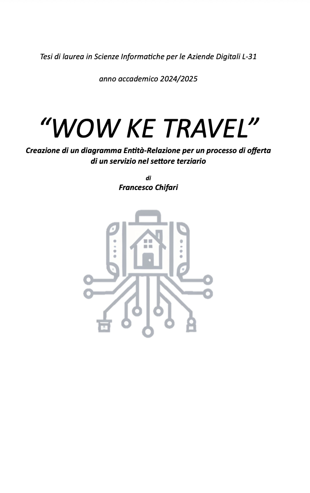
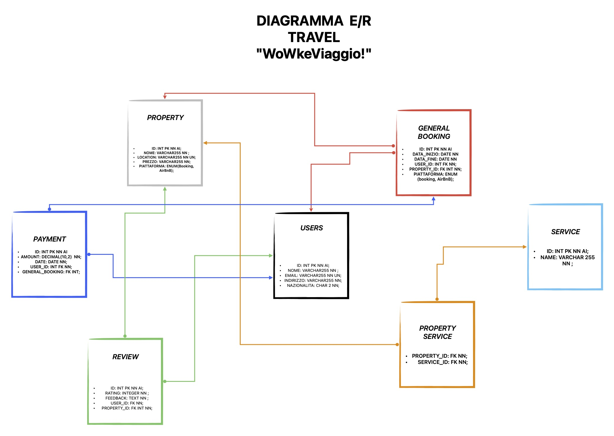

# 🌍 Wow Ke Viaggio



**Wow Ke Viaggio** è un prototipo di piattaforma per la **prenotazione di viaggi e pacchetti vacanza**, sviluppato in **Java** con **Spring Boot** e **JPA/Hibernate**.  
L’applicazione consente la gestione di destinazioni, utenti e prenotazioni, con logica business lato server e persistenza su database relazionale.

---
## Diagramma E-R



## 🧩 Tecnologie utilizzate

- **Backend:** Java 21, Spring Boot
- **Persistenza:** JPA / Hibernate
- **Database:** MySQL
- **Architettura:** RESTful API
- **Testing e Tools:** Postman, Git, GitHub

---

## 🚀 Funzionalità principali

- Gestione delle destinazioni turistiche
- Registrazione utenti e gestione profili
- Prenotazione pacchetti vacanza
- Integrazione con database MySQL
- Diagramma E/R usato per la Tesi di Laurea

---

## 🛠️ Avvio del progetto (locale)

1. Clona il repository:

```bash
git clone https://github.com/CSINCE90/wowkeviaggio.git
cd wowkeviaggio


👨‍💻 Autore

Francesco Chifari
LinkedIn: https://www.linkedin.com/in/francesco-chifari-386550112/
GitHub: CSINCE90
